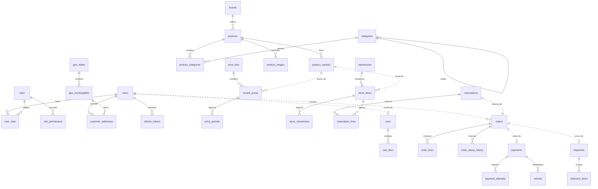

# DATABASE — Modelo de datos

**Estado del diseño: APROBADO (ADR-0066, T-004, 2026-09-25).** Las migraciones se crean en T-110.

Fuentes: `REQUIREMENTS.md`, `BUSINESS_RULES.md`, `DOMAIN_MODEL.md`, ADR-0001 a ADR-0066 y los ADR que modifican el modelo después de su aprobación (ADR-0076, ADR-0078, ADR-0079).

---

## 1. Motor, ORM y convenciones

| Tema | Definición | Fuente |
|---|---|---|
| Motor | PostgreSQL 18, una base de datos y un esquema | ADR-0006, ADR-0025 |
| ORM | Prisma; `@prisma/client` solo en Infrastructure; esquema dividido en archivos por contexto | ADR-0003, ADR-0006 |
| Nombres | Tablas y columnas en `snake_case` y plural para tablas; los modelos de Prisma usan `camelCase` con `@map` | ADR-0066 |
| Identificadores | `uuid` generado por la aplicación: UUIDv7 por defecto (ordenable por tiempo); UUIDv4 donde el identificador funciona como credencial (`carts.id`) | ADR-0059, ADR-0066 |
| Dinero | `integer` en centavos, siempre con moneda `MXN` (máximo representable: 21,474,836.47 por campo) | ADR-0007, ADR-0066 |
| Tasas | `integer` en puntos base (16% = 1600) | ADR-0027, ADR-0066 |
| Fechas | `timestamptz(3)` en UTC | ADR-0036 |
| Estados | Tipos `enum` de PostgreSQL gestionados por Prisma | ADR-0066 |
| Snapshots y opciones | `jsonb` validado por el dominio (dirección en órdenes y envíos, opciones de variante) | ADR-0066 |
| Timestamps | `created_at` y `updated_at` en toda tabla mutable; solo `created_at` (u `occurred_at`) en tablas append-only | ADR-0066 |
| Bloqueo optimista | Columna `version integer NOT NULL DEFAULT 1` en aggregates editables | ADR-0033 |

### Integridad entre contextos (ADR-0005)

- Llaves foráneas solo **dentro** de cada contexto.
- Entre contextos se guarda el ID sin FK; en los diagramas se marca como referencia lógica.
- Excepción: el catálogo geográfico del INEGI es dato de referencia que nunca se borra (los municipios retirados se marcan inactivos, ADR-0057), así que las tablas que lo usan tienen FK hacia él.

### Extensiones de PostgreSQL

| Extensión | Uso | Fuente |
|---|---|---|
| `unaccent` | Búsqueda del catálogo sin acentos | ADR-0060 |
| `btree_gist` | Restricción de exclusión para impedir periodos de precio superpuestos | ADR-0066 |

---

## 2. Mapa de tablas

| Contexto | Tablas |
|---|---|
| Identity & Access | `users`, `roles`, `user_roles`, `role_permissions`, `customer_addresses`, `refresh_tokens`, `email_verification_tokens`, `password_reset_tokens` |
| Catalog | `brands`, `categories`, `products`, `product_categories`, `product_variants`, `product_images` |
| Pricing | `price_lists`, `variant_prices`, `price_periods` |
| Inventory | `warehouses`, `stock_items`, `stock_movements`, `reservations`, `reservation_lines` |
| Shopping | `carts`, `cart_lines` |
| Ordering | `orders`, `order_lines`, `order_status_history` |
| Payments | `payments`, `payment_attempts`, `refunds`, `processed_webhook_events` |
| Shipping | `shipping_methods`, `shipments`, `shipment_items` |
| Transversal | `audit_logs`, `idempotency_keys`, `geo_states`, `geo_municipalities` |

**Correspondencia con los nombres solicitados:**

| Nombre solicitado | Tabla del modelo | Motivo |
|---|---|---|
| users, roles | `users`, `roles`, `user_roles` | — |
| permissions | `role_permissions` | El catálogo de permisos vive en código (ADR-0017, ADR-0043); solo se guardan asignaciones |
| products, categories, product_variants | `products`, `categories`, `product_categories`, `product_variants` | Un producto puede estar en varias categorías |
| inventory | `stock_items`, `reservations`, `reservation_lines` | Existencias y reservas son aggregates distintos (ADR-0011) |
| inventory_movements | `stock_movements` | — |
| carts, cart_items | `carts`, `cart_lines` | — |
| orders, order_items | `orders`, `order_lines`, `order_status_history` | — |
| addresses | `customer_addresses` | Las direcciones de órdenes y envíos son snapshots `jsonb` |
| payments | `payments`, `payment_attempts`, `refunds`, `processed_webhook_events` | — |
| promotions | **No se crea** | Fuera del MVP (ADR-0018); `orders.discount_total` existe desde el inicio |
| audit_logs | `audit_logs` | — |

---

## 3. Identity & Access

### 3.1 `users`

**Propósito:** cuentas de clientes y staff (ADR-0043).

| Campo | Tipo | Nulo | Notas |
|---|---|---|---|
| id | uuid | No | PK (UUIDv7) |
| type | enum `user_type` (CUSTOMER, STAFF) | No | BR-USR-08 |
| email | text | Sí | Normalizado en minúsculas; `NULL` solo en clientes anonimizados |
| first_names | text | Sí | `NULL` en anonimizados |
| last_names | text | Sí | `NULL` en anonimizados |
| password_hash | text | Sí | Argon2id; `NULL` en anonimizados |
| status | enum `user_status` (ACTIVE, SUSPENDED, ANONYMIZED) | No | Default ACTIVE |
| email_verified_at | timestamptz(3) | Sí | Solo relevante para clientes (ADR-0044) |
| must_change_password | boolean | No | Default false; true al crear o reactivar staff con contraseña temporal (ADR-0076) |
| password_changed_at | timestamptz(3) | Sí | — |
| last_login_at | timestamptz(3) | Sí | — |
| suspended_at, anonymized_at | timestamptz(3) | Sí | — |
| privacy_notice_version | text | Sí | Versión del aviso de privacidad presentada al registrarse (ADR-0067); `NULL` en staff |
| version | integer | No | Bloqueo optimista |
| created_at, updated_at | timestamptz(3) | No | — |

- **Restricciones:** `UNIQUE (email)` (los `NULL` no chocan, lo que libera el email de un anonimizado, ADR-0038). `CHECK (status = 'ANONYMIZED' OR (email IS NOT NULL AND password_hash IS NOT NULL AND first_names IS NOT NULL AND last_names IS NOT NULL))`. `CHECK (type = 'CUSTOMER' OR status <> 'ANONYMIZED')` (el staff nunca se anonimiza, BR-USR-06).
- **Índices:** único por `email`; `(type, status)` para listados administrativos.
- **Integridad:** nunca se borra (ADR-0038). "Clientes sin roles" y "no quitar el último superadministrador" se validan en la aplicación (BR-USR-03, BR-USR-08).

### 3.2 `roles`

| Campo | Tipo | Nulo | Notas |
|---|---|---|---|
| id | uuid | No | PK |
| name | text | No | `UNIQUE` |
| description | text | Sí | — |
| is_superadmin | boolean | No | Default false; marca el rol protegido por BR-USR-03 |
| version | integer | No | — |
| created_at, updated_at | timestamptz(3) | No | — |

- **Integridad:** se borra solo sin usuarios asignados (BR-USR-07), garantizado por la FK `RESTRICT` de `user_roles`.

### 3.3 `user_roles`

| Campo | Tipo | Notas |
|---|---|---|
| user_id | uuid | PK compuesta; FK → `users.id` `RESTRICT` |
| role_id | uuid | PK compuesta; FK → `roles.id` `RESTRICT` |
| assigned_at | timestamptz(3) | — |
| assigned_by | uuid | ID del staff (sin FK, dato de auditoría) |

- **Índices:** PK `(user_id, role_id)`; índice por `role_id`.

### 3.4 `role_permissions`

| Campo | Tipo | Notas |
|---|---|---|
| role_id | uuid | PK compuesta; FK → `roles.id` `CASCADE` (al borrar un rol vacío se borran sus asignaciones) |
| permission_code | text | PK compuesta; validado contra el catálogo en código (BR-USR-04) |

### 3.5 `customer_addresses`

**Propósito:** libreta de direcciones del cliente (ADR-0057).

| Campo | Tipo | Nulo | Notas |
|---|---|---|---|
| id | uuid | No | PK |
| user_id | uuid | No | FK → `users.id` `RESTRICT` |
| recipient_name | text | No | Nombre completo de quien recibe |
| phone | char(10) | No | `CHECK (phone ~ '^[0-9]{10}$')` |
| street | text | No | — |
| exterior_number | text | No | Admite "S/N" |
| interior_number | text | Sí | — |
| neighborhood | text | No | Colonia |
| postal_code | char(5) | No | `CHECK (postal_code ~ '^[0-9]{5}$')` |
| state_code | char(2) | No | FK → `geo_states.code` |
| municipality_code | char(5) | No | FK → `geo_municipalities.code` |
| city | text | Sí | — |
| references | text | Sí | Entre calles |
| is_default | boolean | No | Default false |
| created_at, updated_at | timestamptz(3) | No | — |

- **Restricciones:** índice único parcial `(user_id) WHERE is_default` (una predeterminada por cliente). La pertenencia del municipio al estado y el máximo de 10 direcciones se validan en la aplicación, dentro de una transacción que bloquea la fila del usuario (BR-ADR-02, BR-ADR-04). Los nombres de estado y municipio se obtienen del catálogo geográfico; los snapshots de órdenes y envíos guardan clave y nombre (ADR-0057).
- **Índices:** `(user_id)`.
- **Integridad:** borrado físico (ADR-0038); las órdenes guardan su propio snapshot.

### 3.6 Tokens

| Tabla | Campos principales | Restricciones e índices | Retención |
|---|---|---|---|
| `refresh_tokens` | id, user_id (FK `RESTRICT`), session_id (uuid), token_hash (text), expires_at, revoked_at, replaced_by_id, created_at | `UNIQUE (token_hash)`; índices `(user_id)`, `(session_id)` | Se borran 30 días después de vencer o revocarse (ADR-0029) |
| `email_verification_tokens` | id, user_id (FK), email (al que se envió), token_hash, expires_at, used_at, invalidated_at, created_at | `UNIQUE (token_hash)`; índice `(user_id)` | Se borran al vencer o usarse (limpieza diaria) |
| `password_reset_tokens` | id, user_id (FK), token_hash, expires_at, used_at, invalidated_at, created_at | `UNIQUE (token_hash)`; índice `(user_id)` | Se borran al vencer o usarse (limpieza diaria, ADR-0056) |

Todos guardan solo el hash del token (ADR-0023, ADR-0056). Son append-only salvo las columnas de uso, revocación e invalidación.

---

## 4. Catalog

### 4.1 `brands`

| Campo | Tipo | Nulo | Notas |
|---|---|---|---|
| id | uuid | No | PK |
| name | text | No | — |
| slug | text | No | `UNIQUE` |
| status | enum `catalog_status` (ACTIVE, INACTIVE) | No | ADR-0038 |
| created_at, updated_at | timestamptz(3) | No | — |

- **Restricciones:** índice único sobre `lower(name)`.

### 4.2 `categories`

| Campo | Tipo | Nulo | Notas |
|---|---|---|---|
| id | uuid | No | PK |
| parent_id | uuid | Sí | FK → `categories.id` `RESTRICT` |
| name | text | No | — |
| slug | text | No | `UNIQUE` |
| status | enum `catalog_status` | No | — |
| position | integer | No | Orden entre hermanas; default 0 |
| created_at, updated_at | timestamptz(3) | No | — |

- **Restricciones:** `CHECK (parent_id <> id)`; índice único `(parent_id, lower(name)) NULLS NOT DISTINCT` (PostgreSQL 15 o posterior): sin `NULLS NOT DISTINCT`, dos categorías raíz podrían tener el mismo nombre, porque los `NULL` cuentan como distintos. La ausencia de ciclos se valida en la aplicación al mover (BR-PRD-03). Solo se borra sin productos ni subcategorías (BR-PRD-10), garantizado por las FK `RESTRICT`.
- **Índices:** `(parent_id)`.

### 4.3 `products`

| Campo | Tipo | Nulo | Notas |
|---|---|---|---|
| id | uuid | No | PK |
| title | text | No | — |
| slug | text | No | `UNIQUE`; nunca se reutiliza (BR-PRD-09) |
| description | text | Sí | — |
| brand_id | uuid | Sí | FK → `brands.id` `RESTRICT` |
| status | enum `product_status` (DRAFT, PUBLISHED, ARCHIVED) | No | Default DRAFT |
| published_at, archived_at | timestamptz(3) | Sí | `published_at` alimenta el orden "más recientes" (ADR-0060) |
| first_published_at | timestamptz(3) | Sí | Se fija en la primera publicación y no cambia; mientras es `NULL`, SKU y opciones de sus variantes son editables (ADR-0068) |
| search_vector | tsvector | Sí | Título, marca y categorías visibles (ADR-0080); configuración en español con `unaccent`; lo actualiza la aplicación al cambiar esos datos, incluida la visibilidad de sus categorías |
| version | integer | No | — |
| created_at, updated_at | timestamptz(3) | No | — |

- **Índices:** GIN sobre `search_vector`; `(status, published_at DESC)`; `(brand_id)`.
- **Integridad:** nunca se borra; se archiva (BR-PRD-07).

### 4.4 `product_categories`

| Campo | Tipo | Notas |
|---|---|---|
| product_id | uuid | PK compuesta; FK → `products.id` `CASCADE` |
| category_id | uuid | PK compuesta; FK → `categories.id` `RESTRICT` |

- **Índices:** `(category_id)` para el filtro por categoría.

### 4.5 `product_variants`

| Campo | Tipo | Nulo | Notas |
|---|---|---|---|
| id | uuid | No | PK |
| product_id | uuid | No | FK → `products.id` `RESTRICT` |
| sku | text | No | `UNIQUE`; normalizado en mayúsculas; nunca se reutiliza (BR-PRD-09) |
| options | jsonb | No | Objeto atributo → valor (por ejemplo, talla y color); `{}` si no hay opciones |
| status | enum `variant_status` (ACTIVE, DISCONTINUED) | No | — |
| weight_grams | integer | Sí | `CHECK (weight_grams > 0)` (ADR-0058) |
| length_cm, width_cm, height_cm | numeric(7,1) | Sí | `CHECK (> 0)` cada una |
| created_at, updated_at | timestamptz(3) | No | — |

- **Restricciones:** índice único parcial `(product_id, options) WHERE status = 'ACTIVE'` (ADR-0076): `jsonb` normaliza el orden de las llaves, así que dos combinaciones iguales entre variantes activas chocan (BR-PRD-02). Las descontinuadas no cuentan, lo que permite corregir una variante descontinuándola y creando otra con las mismas opciones (ADR-0068).
- **Índices:** `(product_id)`.
- **Integridad:** nunca se borra; se descontinúa. SKU y opciones son editables solo mientras el producto no tiene `first_published_at`; peso, dimensiones y estado, siempre (ADR-0068).

### 4.6 `product_images`

| Campo | Tipo | Nulo | Notas |
|---|---|---|---|
| id | uuid | No | PK |
| product_id | uuid | No | FK → `products.id` `CASCADE` |
| variant_id | uuid | Sí | FK → `product_variants.id` `SET NULL` |
| storage_key | text | No | `UNIQUE`; ruta relativa (ADR-0024) |
| content_type | text | No | `CHECK (content_type IN ('image/jpeg','image/png','image/webp'))` |
| size_bytes | integer | No | `CHECK (size_bytes > 0 AND size_bytes <= 5242880)` |
| alt_text | text | Sí | — |
| position | integer | No | Orden de presentación |
| created_at | timestamptz(3) | No | — |

- **Índices:** `(product_id, position)`.
- **Integridad:** borrado físico junto con el archivo (ADR-0038). El límite de tamaño es configurable; el `CHECK` refleja el valor inicial y se ajusta con una migración si cambia.

---

## 5. Pricing

### 5.1 `price_lists`

| Campo | Tipo | Nulo | Notas |
|---|---|---|---|
| id | uuid | No | PK |
| code | text | No | `UNIQUE` |
| name | text | No | — |
| currency | char(3) | No | `CHECK (currency = 'MXN')` (ADR-0026) |
| priority | integer | No | — |
| is_default | boolean | No | — |
| taxes_included | boolean | No | Default true (ADR-0008) |
| status | enum `catalog_status` | No | — |
| version | integer | No | — |
| created_at, updated_at | timestamptz(3) | No | — |

- **Restricciones:** único parcial `(is_default) WHERE is_default` (una sola predeterminada); único parcial `(priority) WHERE status = 'ACTIVE'` (BR-PRC-08); `CHECK (NOT is_default OR status = 'ACTIVE')` (la predeterminada no se desactiva, BR-PRC-06).

### 5.2 `variant_prices`

**Propósito:** aggregate `VariantPrice`, uno por lista y variante.

| Campo | Tipo | Notas |
|---|---|---|
| id | uuid | PK |
| price_list_id | uuid | FK → `price_lists.id` `RESTRICT` |
| variant_id | uuid | Referencia lógica a Catalog (sin FK) |
| version | integer | Bloqueo optimista |
| created_at, updated_at | timestamptz(3) | — |

- **Restricciones:** `UNIQUE (price_list_id, variant_id)`.
- **Índices:** `(variant_id)`.

### 5.3 `price_periods`

| Campo | Tipo | Nulo | Notas |
|---|---|---|---|
| id | uuid | No | PK |
| variant_price_id | uuid | No | FK → `variant_prices.id` `RESTRICT` |
| amount | integer | No | Centavos, IVA según la lista; `CHECK (amount >= 0)` |
| compare_at_amount | integer | Sí | `CHECK (compare_at_amount IS NULL OR compare_at_amount > amount)` |
| effective_from | timestamptz(3) | No | — |
| effective_to | timestamptz(3) | Sí | `NULL` = sin fin; `CHECK (effective_to IS NULL OR effective_to > effective_from)` |
| created_by | uuid | No | ID del staff (sin FK) |
| created_at | timestamptz(3) | No | — |

- **Restricciones:** `EXCLUDE USING gist (variant_price_id WITH =, tstzrange(effective_from, effective_to, '[)') WITH &&)`: la base de datos impide periodos superpuestos (BR-PRC-01) aunque falle la validación de la aplicación.
- **Índices:** `(variant_price_id, effective_from)`.
- **Integridad:** los periodos iniciados son inmutables (BR-PRC-04): solo se permite cerrar el vigente fijando `effective_to`; los futuros no iniciados se pueden borrar.

---

## 6. Inventory

### 6.1 `warehouses`

| Campo | Tipo | Nulo | Notas |
|---|---|---|---|
| id | uuid | No | PK |
| code | text | No | `UNIQUE` |
| name | text | No | — |
| address | jsonb | Sí | Formato de ADR-0057 |
| status | enum `catalog_status` | No | — |
| created_at, updated_at | timestamptz(3) | No | — |

### 6.2 `stock_items` (inventory)

| Campo | Tipo | Nulo | Notas |
|---|---|---|---|
| id | uuid | No | PK |
| variant_id | uuid | No | Referencia lógica a Catalog |
| warehouse_id | uuid | No | FK → `warehouses.id` `RESTRICT` |
| on_hand | integer | No | Default 0 |
| reserved | integer | No | Default 0 |
| created_at, updated_at | timestamptz(3) | No | — |

- **Restricciones:** `UNIQUE (variant_id, warehouse_id)`; `CHECK (reserved >= 0 AND reserved <= on_hand)` (BR-INV-01).
- **Índices:** el único cubre la búsqueda por variante.
- **Concurrencia:** sin columna `version`; se actualiza con sentencias condicionales atómicas (sección 12).

### 6.3 `stock_movements` (inventory_movements)

**Propósito:** libro append-only de cambios en `on_hand` (BR-INV-05).

| Campo | Tipo | Nulo | Notas |
|---|---|---|---|
| id | uuid | No | PK |
| stock_item_id | uuid | No | FK → `stock_items.id` `RESTRICT` |
| type | enum `stock_movement_type` (RECEIPT, ADJUSTMENT, SALE, RESTOCK) | No | SALE al confirmar reserva; RESTOCK al reintegrar (ADR-0052) |
| quantity | integer | No | Con signo; `CHECK (quantity <> 0)` |
| on_hand_after | integer | No | `CHECK (on_hand_after >= 0)`; facilita la conciliación |
| reason_code | enum `stock_movement_reason` (PHYSICAL_COUNT, DAMAGED, LOSS_OR_THEFT, INTERNAL_USE, DATA_ENTRY_ERROR, OTHER, ORDER_CANCELLED, SHIPMENT_RETURNED) | Sí | Obligatorio en ADJUSTMENT y RESTOCK; `NULL` en RECEIPT y SALE (ADR-0069) |
| note | text | Sí | Opcional; obligatoria con OTHER |
| order_id | uuid | Sí | Referencia lógica a Ordering (SALE, RESTOCK) |
| order_line_id | uuid | Sí | Referencia lógica a Ordering (RESTOCK) |
| actor_id | uuid | Sí | Staff o `NULL` si es el sistema |
| created_at | timestamptz(3) | No | — |

- **Restricciones:** `CHECK ((type IN ('ADJUSTMENT','RESTOCK')) = (reason_code IS NOT NULL))`; `CHECK (type <> 'ADJUSTMENT' OR reason_code IN ('PHYSICAL_COUNT','DAMAGED','LOSS_OR_THEFT','INTERNAL_USE','DATA_ENTRY_ERROR','OTHER'))`; `CHECK (type <> 'RESTOCK' OR reason_code IN ('ORDER_CANCELLED','SHIPMENT_RETURNED'))`; `CHECK (reason_code NOT IN ('DAMAGED','LOSS_OR_THEFT','INTERNAL_USE') OR quantity < 0)`; `CHECK (reason_code <> 'OTHER' OR note IS NOT NULL)`; `CHECK (type <> 'RECEIPT' OR quantity > 0)`; `CHECK (type <> 'SALE' OR quantity < 0)`; `CHECK (type <> 'RESTOCK' OR (quantity > 0 AND order_id IS NOT NULL AND order_line_id IS NOT NULL))`.
- **Índices:** `(stock_item_id, created_at)`; `(order_line_id) WHERE type = 'RESTOCK'` (tope de reintegro, sección 12).
- **Integridad:** nunca se modifica ni se borra (ADR-0038).

### 6.4 `reservations`

| Campo | Tipo | Nulo | Notas |
|---|---|---|---|
| id | uuid | No | PK |
| order_id | uuid | No | Referencia lógica a Ordering |
| status | enum `reservation_status` (ACTIVE, COMMITTED, RELEASED, EXPIRED) | No | BR-INV-03 |
| expires_at | timestamptz(3) | No | Colocación + TTL (20 minutos) |
| version | integer | No | — |
| created_at, updated_at | timestamptz(3) | No | — |

- **Restricciones:** único parcial `(order_id) WHERE status = 'ACTIVE'` (BR-INV-04).
- **Índices:** `(expires_at) WHERE status = 'ACTIVE'` (job de expiración).

### 6.5 `reservation_lines`

| Campo | Tipo | Notas |
|---|---|---|
| reservation_id | uuid | PK compuesta; FK → `reservations.id` `CASCADE` |
| stock_item_id | uuid | PK compuesta; FK → `stock_items.id` `RESTRICT` |
| quantity | integer | `CHECK (quantity > 0)` |

---

## 7. Shopping

### 7.1 `carts`

| Campo | Tipo | Nulo | Notas |
|---|---|---|---|
| id | uuid | No | PK; **UUIDv4** porque es la credencial del carrito de invitado (ADR-0059) |
| owner_user_id | uuid | Sí | Referencia lógica a Identity; `NULL` = carrito de invitado |
| status | enum `cart_status` (ACTIVE, CHECKED_OUT, MERGED) | No | — |
| merged_into_cart_id | uuid | Sí | FK → `carts.id`; permite la fusión idempotente (ADR-0059) |
| last_activity_at | timestamptz(3) | No | Base de la limpieza de 30 días (BR-CRT-06) |
| version | integer | No | — |
| created_at, updated_at | timestamptz(3) | No | — |

- **Restricciones:** único parcial `(owner_user_id) WHERE status = 'ACTIVE' AND owner_user_id IS NOT NULL` (un carrito activo por cliente, BR-CRT-03); `CHECK (status <> 'MERGED' OR merged_into_cart_id IS NOT NULL)`.
- **Índices:** `(last_activity_at) WHERE owner_user_id IS NULL` (limpieza de invitados).

### 7.2 `cart_lines` (cart_items)

| Campo | Tipo | Notas |
|---|---|---|
| cart_id | uuid | PK compuesta; FK → `carts.id` `CASCADE` |
| variant_id | uuid | PK compuesta; referencia lógica a Catalog (una línea por variante, BR-CRT-01) |
| quantity | integer | `CHECK (quantity BETWEEN 1 AND 30)` (BR-CRT-02) |
| created_at, updated_at | timestamptz(3) | — |

- No guarda precios (BR-CRT-04).

---

## 8. Ordering

### 8.1 `orders`

| Campo | Tipo | Nulo | Notas |
|---|---|---|---|
| id | uuid | No | PK |
| order_number | bigint | No | `UNIQUE`; secuencia `order_number_seq`; interno (ADR-0049) |
| public_code | char(8) | No | `UNIQUE`; Base32 Crockford en mayúsculas, sin guion (el guion es de presentación) |
| customer_id | uuid | Sí | Referencia lógica a Identity; `NULL` = invitado |
| contact_email | text | Sí | Normalizado en minúsculas; `NULL` solo en órdenes anonimizadas (ADR-0067) |
| status | enum `order_status` (PENDING_PAYMENT, PAID, AWAITING_MANUAL_FULFILLMENT, SHIPPED, DELIVERED, CANCELLED, EXPIRED, REFUNDED) | No | ADR-0009, ADR-0051 |
| currency | char(3) | No | `CHECK (currency = 'MXN')` |
| subtotal | integer | No | Suma de líneas, IVA incluido |
| tax_total | integer | No | IVA contenido en el subtotal y en el costo de envío (informativo, ADR-0079) |
| shipping_cost | integer | No | Snapshot, IVA incluido (ADR-0042, ADR-0079) |
| shipping_tax_amount | integer | No | IVA contenido en `shipping_cost`; 0 con envío gratis (ADR-0079) |
| shipping_tax_rate_bp | integer | No | Tasa aplicada al envío, en puntos base (ADR-0079) |
| discount_total | integer | No | Default 0 (ADR-0018) |
| grand_total | integer | No | — |
| shipping_address | jsonb | No | Snapshot con el formato de ADR-0057 |
| reservation_id | uuid | Sí | Referencia lógica a Inventory |
| source_cart_id | uuid | No | Referencia lógica a Shopping (restauración, ADR-0054) |
| privacy_notice_version | text | Sí | Versión del aviso presentada en el checkout de invitado (ADR-0067) |
| anonymized_at | timestamptz(3) | Sí | Marca de anonimización (ADR-0067) |
| placed_at | timestamptz(3) | No | — |
| paid_at, shipped_at, delivered_at, cancelled_at, expired_at, refunded_at | timestamptz(3) | Sí | — |
| version | integer | No | — |
| created_at, updated_at | timestamptz(3) | No | — |

- **Restricciones:** `CHECK (subtotal >= 0 AND tax_total >= 0 AND tax_total <= subtotal + shipping_cost AND shipping_cost >= 0 AND discount_total >= 0)`; `CHECK (shipping_tax_amount >= 0 AND shipping_tax_amount <= shipping_cost AND shipping_tax_amount <= tax_total AND shipping_tax_rate_bp >= 0)` (ADR-0079); `CHECK (grand_total = subtotal + shipping_cost - discount_total)`; `CHECK (public_code ~ '^[0-9A-HJKMNP-TV-Z]{8}$')`; `CHECK (anonymized_at IS NOT NULL OR contact_email IS NOT NULL)`; `CHECK (customer_id IS NOT NULL OR anonymized_at IS NOT NULL OR privacy_notice_version IS NOT NULL)` (un invitado siempre registra la versión del aviso).
- **Índices:** únicos de `order_number` y `public_code`; `(customer_id, placed_at DESC)`; `(status, placed_at DESC)`; `(contact_email)` (consulta de invitado).
- **Integridad:** nunca se borra. Que las transiciones de estado sean válidas lo garantiza el aggregate; cada cambio se registra en `order_status_history`.

### 8.2 `order_lines` (order_items)

| Campo | Tipo | Notas |
|---|---|---|
| id | uuid | PK |
| order_id | uuid | FK → `orders.id` `RESTRICT` |
| line_number | integer | `UNIQUE (order_id, line_number)` |
| variant_id | uuid | Referencia lógica a Catalog |
| sku | text | Snapshot |
| product_name | text | Snapshot |
| variant_options | jsonb | Snapshot |
| unit_price | integer | Snapshot, IVA incluido; `CHECK (unit_price >= 0)` |
| quantity | integer | `CHECK (quantity BETWEEN 1 AND 30)` |
| tax_rate_bp | integer | Snapshot en puntos base (1600); `CHECK (tax_rate_bp >= 0)` |
| tax_amount | integer | IVA contenido en la línea, redondeado por línea (ADR-0008) |
| line_total | integer | `CHECK (line_total = unit_price * quantity)` |

- **Integridad:** inmutables tras colocar la orden (BR-ORD-03); `grand_total` y `subtotal` se validan contra la suma de líneas en la aplicación (sin trigger, para no duplicar la lógica del aggregate).

### 8.3 `order_status_history`

| Campo | Tipo | Notas |
|---|---|---|
| id | uuid | PK |
| order_id | uuid | FK → `orders.id` `RESTRICT` |
| from_status | enum `order_status` | `NULL` en la creación |
| to_status | enum `order_status` | — |
| actor_id | uuid | Staff, cliente o `NULL` para el sistema |
| reason | text | Motivo de cancelación u otra nota |
| occurred_at | timestamptz(3) | — |

- **Índices:** `(order_id, occurred_at)`. Append-only.

---

## 9. Payments

### 9.1 `payments`

| Campo | Tipo | Nulo | Notas |
|---|---|---|---|
| id | uuid | No | PK |
| order_id | uuid | No | Referencia lógica a Ordering; `UNIQUE` (BR-PAY-01) |
| provider | enum `payment_provider` (MANUAL, PAYPAL) | No | ADR-0040 |
| status | enum `payment_status` (PENDING, REQUIRES_ACTION, AUTHORIZED, CAPTURED, FAILED, CANCELLED, PARTIALLY_REFUNDED, REFUNDED) | No | ADR-0013 |
| amount | integer | No | Total de la orden; `CHECK (amount > 0)` |
| captured_amount | integer | No | Default 0 |
| refunded_amount | integer | No | Default 0 |
| currency | char(3) | No | `CHECK (currency = 'MXN')` |
| provider_payment_id | text | Sí | — |
| captured_at | timestamptz(3) | Sí | — |
| version | integer | No | — |
| created_at, updated_at | timestamptz(3) | No | — |

- **Restricciones:** `CHECK (captured_amount BETWEEN 0 AND amount)`; `CHECK (refunded_amount BETWEEN 0 AND captured_amount)` (BR-PAY-04); único parcial `(provider, provider_payment_id) WHERE provider_payment_id IS NOT NULL`.
- **Índices:** `(status, updated_at)` (conciliación, ADR-0029).

### 9.2 `payment_attempts`

| Campo | Tipo | Notas |
|---|---|---|
| id | uuid | PK |
| payment_id | uuid | FK → `payments.id` `RESTRICT` |
| status | enum `payment_status` | Resultado del intento |
| provider_reference | text | — |
| failure_code | text | — |
| registered_by | uuid | Staff que registró un pago manual (sin FK) |
| created_at | timestamptz(3) | Append-only |

### 9.3 `refunds`

| Campo | Tipo | Nulo | Notas |
|---|---|---|---|
| id | uuid | No | PK |
| payment_id | uuid | No | FK → `payments.id` `RESTRICT` |
| amount | integer | No | `CHECK (amount > 0)` |
| status | enum `refund_status` (PENDING, COMPLETED, FAILED) | No | ADR-0051 |
| provider_refund_id | text | Sí | — |
| registered_by | uuid | Sí | Staff en reembolsos manuales |
| created_at, updated_at | timestamptz(3) | No | — |
| completed_at | timestamptz(3) | Sí | — |

- **Restricciones:** único parcial `(payment_id) WHERE status IN ('PENDING','COMPLETED')` (un solo reembolso total en curso o completado; los fallidos quedan como historial de reintentos, ADR-0051).

### 9.4 `processed_webhook_events`

| Campo | Tipo | Notas |
|---|---|---|
| provider | enum `payment_provider` | PK compuesta |
| event_id | text | PK compuesta (BR-PAY-06) |
| processed_at | timestamptz(3) | Retención 30 días (ADR-0029) |

---

## 10. Shipping

### 10.1 `shipping_methods`

| Campo | Tipo | Nulo | Notas |
|---|---|---|---|
| id | uuid | No | PK |
| name | text | No | — |
| flat_fee | integer | No | `CHECK (flat_fee >= 0)`; IVA incluido (ADR-0042, ADR-0079) |
| free_shipping_threshold | integer | Sí | `CHECK (free_shipping_threshold IS NULL OR free_shipping_threshold > 0)` |
| is_active | boolean | No | — |
| version | integer | No | — |
| created_at, updated_at | timestamptz(3) | No | — |

- **Restricciones:** único parcial `(is_active) WHERE is_active` (un solo método activo en el MVP). El umbral se compara con el subtotal con IVA menos el descuento (ADR-0079).

### 10.2 `shipments`

| Campo | Tipo | Nulo | Notas |
|---|---|---|---|
| id | uuid | No | PK |
| order_id | uuid | No | Referencia lógica a Ordering; `UNIQUE` en el MVP (una orden, un envío; se retira al habilitar envíos parciales) |
| warehouse_id | uuid | No | Referencia lógica a Inventory |
| status | enum `shipment_status` (PENDING, DISPATCHED, DELIVERED, DELIVERY_FAILED, RETURNED) | No | ADR-0050, ADR-0053 |
| destination | jsonb | No | Snapshot de dirección; al anonimizar se conservan solo estado, municipio y código postal (ADR-0067) |
| anonymized_at | timestamptz(3) | Sí | Marca de anonimización (ADR-0067) |
| carrier_name | text | Sí | — |
| tracking_number | text | Sí | — |
| own_delivery | boolean | No | Default `false`; entrega propia de la tienda, sin paquetería ni guía (ADR-0078) |
| dispatched_at, delivered_at, failed_at, returned_at | timestamptz(3) | Sí | — |
| version | integer | No | — |
| created_at, updated_at | timestamptz(3) | No | — |

- **Restricciones:** `CHECK (status = 'PENDING' OR dispatched_at IS NOT NULL)`; `CHECK (status = 'PENDING' OR own_delivery OR (carrier_name IS NOT NULL AND tracking_number IS NOT NULL))` (fuera de PENDING, un envío tiene paquetería y guía o es entrega propia, BR-SHP-04); `CHECK (NOT own_delivery OR (carrier_name IS NULL AND tracking_number IS NULL))` (ADR-0078).
- **Índices:** `(status, created_at)` (lista de trabajo del staff).

### 10.3 `shipment_items`

| Campo | Tipo | Notas |
|---|---|---|
| shipment_id | uuid | PK compuesta; FK → `shipments.id` `CASCADE` |
| order_line_id | uuid | PK compuesta; referencia lógica a Ordering |
| quantity | integer | `CHECK (quantity > 0)` |

---

## 11. Transversales

### 11.1 `audit_logs`

| Campo | Tipo | Nulo | Notas |
|---|---|---|---|
| id | uuid | No | PK (UUIDv7) |
| occurred_at | timestamptz(3) | No | — |
| actor_type | enum `actor_type` (USER, SYSTEM, ANONYMOUS) | No | Anónimo en intentos de login fallidos |
| actor_id | uuid | Sí | Sin FK |
| action | text | No | Código estable (por ejemplo, `orders.cancel`) |
| resource_type | text | Sí | — |
| resource_id | text | Sí | — |
| result | enum `audit_result` (SUCCESS, DENIED, FAILED) | No | — |
| correlation_id | text | Sí | ADR-0033 |
| ip | inet | Sí | — |
| user_agent | text | Sí | — |
| changes | jsonb | Sí | Solo campos modificados; sin valores de campos sensibles ni personales (ADR-0037, ADR-0067) |

- **Índices:** `(occurred_at, id)` (paginación por cursor y exportación diaria); `(resource_type, resource_id)`; `(actor_id, occurred_at)`.
- **Integridad:** trigger que rechaza `UPDATE`; solo el job de retención borra registros (ADR-0037).

### 11.2 `idempotency_keys`

| Campo | Tipo | Nulo | Notas |
|---|---|---|---|
| scope_type | enum `idempotency_scope` (USER, CART) | No | PK compuesta (ADR-0063) |
| scope_id | uuid | No | PK compuesta |
| endpoint | text | No | PK compuesta |
| key | text | No | PK compuesta; `CHECK (char_length(key) BETWEEN 1 AND 255)` |
| request_hash | text | No | Huella del contenido |
| status | enum `idempotency_status` (IN_PROGRESS, COMPLETED) | No | — |
| response_status | integer | Sí | — |
| response_body | jsonb | Sí | — |
| created_at | timestamptz(3) | No | — |
| expires_at | timestamptz(3) | No | +24 horas |

- **Índices:** `(expires_at)` para la limpieza.

### 11.3 `geo_states` y `geo_municipalities`

| Tabla | Campos | Restricciones |
|---|---|---|
| `geo_states` | code char(2) PK, name text, updated_at | `CHECK (code ~ '^[0-9]{2}$')` |
| `geo_municipalities` | code char(5) PK (clave de entidad y municipio del INEGI), state_code char(2) FK → `geo_states`, name text, is_active boolean, updated_at | `CHECK (left(code, 2) = state_code)`; índice `(state_code, name)` |

Se cargan con el script de UC-IAM-21; nunca se borran (ADR-0057).

---

## 12. Integridad de inventario y concurrencia

| Riesgo | Protección en la aplicación | Protección en la base |
|---|---|---|
| Sobreventa | Reserva todo o nada en una transacción; cada línea con `UPDATE stock_items SET reserved = reserved + q WHERE id = $1 AND on_hand - reserved >= q`; si alguna afecta 0 filas, se revierte todo | `CHECK (reserved >= 0 AND reserved <= on_hand)` |
| Deadlocks | Las líneas se actualizan en orden ascendente de `stock_item_id` | — |
| Doble reserva de una orden | Reserva idempotente por orden | Único parcial en `reservations (order_id) WHERE status = 'ACTIVE'` |
| Confirmación doble | Transición Active → Committed una sola vez; `UPDATE ... SET on_hand = on_hand - q, reserved = reserved - q` | `CHECK` de `stock_items`; `version` de `reservations` |
| Reintegro doble | Antes de reintegrar, se suma lo reintegrado por `order_line_id` en `stock_movements` y se compara con lo vendido; el `UPDATE` del `stock_item` serializa reintegros concurrentes de la misma variante | Índice parcial de RESTOCK por `order_line_id` |
| Ajuste por debajo de lo reservado | Validación en el aggregate | `CHECK` de `stock_items` |
| Descuadre del libro | Cada cambio de `on_hand` escribe un movimiento en la misma transacción con `on_hand_after` | Conciliación verificable: la suma de movimientos por `stock_item` debe igualar `on_hand` (consulta de verificación en los tests de integración) |

**Otras reglas de concurrencia:**

- Bloqueo optimista con `version` en `users`, `roles`, `products`, `price_lists`, `variant_prices`, `reservations`, `carts`, `orders`, `payments`, `shipping_methods` y `shipments`; un conflicto responde 409 (ADR-0064).
- Transacciones propagadas con `nestjs-cls` (ADR-0033); aislamiento Read Committed; ninguna llamada externa dentro de una transacción.
- Checkout en una transacción (ADR-0019): reserva, orden, líneas, historial y cambio de estado del carrito.
- Auditoría en la misma transacción que el cambio (ADR-0037).

---

## 13. Estrategia de migraciones

- **Herramienta:** Prisma Migrate (ADR-0033), con el esquema dividido en archivos por contexto.
- **SQL manual dentro de las migraciones** para lo que el esquema de Prisma no expresa: extensiones (`unaccent`, `btree_gist`), `CHECK`, restricción de exclusión de `price_periods`, índices únicos parciales, índices GIN y de expresión, secuencia `order_number_seq` y trigger de `audit_logs`. Flujo: generar la migración sin aplicarla, agregar el SQL, revisarla y aplicarla.
- **Riesgo a validar en T-110:** Prisma no conoce estos objetos; hay que comprobar que la verificación de migraciones de la CI (ADR-0030) no los detecte como diferencias ni intente eliminarlos.
- **Sin migraciones de reversión:** Prisma solo avanza. Un error se corrige con una migración nueva; antes de aplicar migraciones con datos reales se toma un respaldo.
- **Cambios incompatibles:** en dos pasos (primero agregar, migrar datos y actualizar el código; después retirar lo viejo). Toda migración destructiva requiere aprobación humana (`TEAM_GUIDE.md`).
- **Datos iniciales (seed):** roles iniciales con sus permisos (ADR-0043), lista de precios predeterminada, almacén predeterminado y método de envío. Sin usuarios: el primer superadministrador se crea con su script (ADR-0043) y el catálogo geográfico con el suyo (ADR-0057).
- **Primera migración:** se genera en T-110, después de aprobar este diseño.

---

## 14. Auditoría y retenciones

- **Historia de negocio en cada contexto:** `order_status_history`, `stock_movements` y `price_periods`.
- **Auditoría técnica** (ADR-0037): `audit_logs` guarda 3 meses; después, el job diario exporta a archivos comprimidos y borra (sección 11.1).

| Tabla | Retención | Fuente |
|---|---|---|
| `audit_logs` | 3 meses en base; 2 años en archivos | ADR-0037 |
| `refresh_tokens` | 30 días tras vencer o revocarse | ADR-0029 |
| `email_verification_tokens`, `password_reset_tokens` | Hasta vencer o usarse | ADR-0056 |
| `idempotency_keys` | 24 horas | ADR-0063 |
| `processed_webhook_events` | 30 días | ADR-0029 |
| `carts` de invitado inactivos | 30 días | ADR-0029 |
| Órdenes, pagos, envíos, movimientos | Nunca se borran | ADR-0038 |
| Datos personales en órdenes y envíos | Fases operativa, bloqueo y anonimización con plazos pendientes de validación legal (P-61); fuera del MVP. Al implementarse se agregará una marca de bloqueo en `orders` y `shipments` | ADR-0067, ADR-0070 |

---

## 15. Eliminación lógica

ADR-0038: sin columna `deleted_at` genérica. Estados de negocio para entidades con valor histórico y borrado físico donde nada las referencia.

- Archivar o desactivar: productos, variantes (descontinuar), almacenes, listas de precios; categorías y marcas con productos o subcategorías.
- Suspender: staff (nunca se borra) y clientes. Un cliente que pide eliminar su cuenta se anonimiza (ADR-0067): se vacían sus datos en `users`, se borran tokens, direcciones y carritos, y se eliminan los identificadores directos de sus órdenes y envíos, conservando estado, municipio y código postal.
- Borrado físico: imágenes (registro y archivo), direcciones del cliente, periodos de precio futuros no iniciados, roles sin usuarios, categorías y marcas vacías.
- Nunca se borran: órdenes, pagos, envíos, movimientos de stock, periodos de precio iniciados.
- Un SKU nunca se reutiliza; el slug de un producto archivado sigue reservado; el email de un cliente anonimizado se libera.

---

## 16. Diagrama ER

Líneas continuas: FK dentro del contexto. Líneas punteadas: referencias lógicas entre contextos, sin FK.

